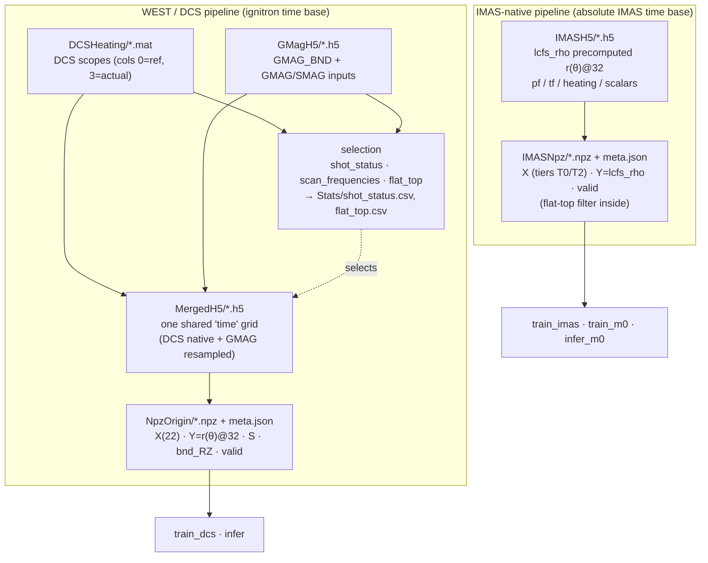
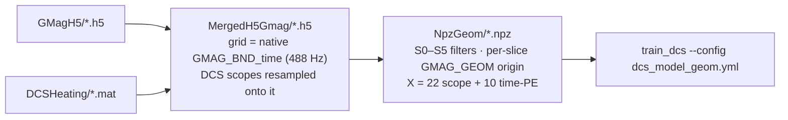

# Data Lineage

How raw WEST acquisition data flows through this repo into the trainable
artifacts consumed by the LCFS reconstruction models. There are **two parallel
pipelines** — a WEST/DCS track and an IMAS-native track — both ending in a polar
`r(θ)` boundary target on a fixed 32-angle grid. Selection criteria (which shots
enter the dataset) are documented in [`README.md`](../README.md); this page is
about *what each stage reads, transforms, and writes*.

> **Directory note.** The WEST trainable dir on disk is `ProjDB/datasets/NpzOrigin`
> (formerly `MergedNpz`; the rename records that it uses coordinate origin
> `(2.5, 0)`). `src/proj_config.py:mergednpz_dir` still returns the old literal
> `"MergedNpz"`, so it currently points at a missing dir — see
> [§9 Directory & config map](#9-directory--config-map).

---

## 1. Overview

Both pipelines reconstruct the WEST last-closed-flux-surface (LCFS) from
control-system and diagnostic inputs:

- **WEST / DCS** — DCS scope archives (`.mat`) + GMAG equilibrium HDF5 (`.h5`),
  merged onto one ignitron-time grid, then encoded as polar radii about the fixed
  origin `(2.5, 0)` m. Target: `targets/GMAG_BND` → `Y = r(θ)@32`.
- **IMAS** — IMAS-native HDF5 export whose `lcfs_rho` is *already* the polar
  `r(θ)@32` profile (precomputed upstream); this repo only selects, flattens, and
  filters it.

Vessel/PFC wall geometry used for plotting comes from the public **ToFu** repo
(external); it is a visualization asset, not part of the training data.

---

## 2. Raw sources (external — not built by this repo)

| Source | Path | Contents | Time base |
|---|---|---|---|
| DCS archive | `ProjDB/datasets/DCSHeating/DCS_archive_<shot>.mat` | 30 `*_scope` nodes sharing `Ip_scope.time`; columns `0`=ref, `3`=actual | ignitron (t=0 @ ignitron); ~1 kHz PCS grid (`Ip_scope.time`) |
| GMAG equilibrium | `ProjDB/datasets/GMagH5/<shot>.h5` | `targets/GMAG_BND` + `inputs/GMAG_*` / `SMAG_*`, each with its own `<name>_time` | ignitron (t=0 @ ignitron); raw `GMAG_BND_time` spans ≈ −30 → +38 s (valid LCFS only in the discharge window) |
| IMAS export | `ProjDB/datasets/IMASH5/<shot>.h5` | `lcfs_rho` (50,32), `lcfs_theta`, `pf_*`, `ip`, heating powers, scalars | absolute IMAS seconds |
| Wall polygons | ToFu repo (`WEST-V0…V4`) | vessel / PFC R–Z contours | n/a |

**Time base (NpzOrigin).** WEST sources are **ignitron-relative** — t=0 is the
ignitron firing (`time_reference='ignitron'`; each GMagH5 file also stores
`t_ignitron_absolute`, the absolute epoch of the ignitron). Raw `GMAG_BND_time`
covers a wide window (≈ −30 → +38 s) but only the discharge middle holds valid
LCFS. `MergedH5` / `NpzOrigin` inherit this ignitron base on the **~1 kHz merged
DCS grid**; `build_npz` further windows to the valid discharge, so each
`NpzOrigin` `time` array **starts at the equilibrium start** (e.g. ≈ +0.056 s for
shot 57281 — this is `meta.json:t_start`), **not** at t=0, and is sampled at
~1 kHz (the merged grid), not the raw 488 Hz. Example (shot 57281):
raw `GMAG_BND_time` −30.07 → +37.80 s @ 488 Hz → `MergedH5.time` −29.40 → +11.87 s
@ ~1 kHz → `NpzOrigin.time` +0.056 → +11.87 s @ ~1 kHz.

**GMAG sampling-rate tiers** (from the time vectors; relevant to the `fs > 400 Hz`
quality gate): the GMAG/SMAG equilibrium suite runs at **488 Hz** (with ~9
anomalous shots at **30 Hz**), poloidal `GPOLO` at **977 Hz**, divertor `GDIV` at
**977 / 1953 Hz** (bimodal across the campaign), DCS scopes at ~1 kHz.

---

## 3. Lineage diagram



---

## 4. WEST / DCS stages

Driven in order by `scripts/run_data_pre.py`:

| # | Stage | Script / module | Reads | Writes | Key operation |
|---|---|---|---|---|---|
| 1 | status + freq scan | `src/data/shot_status.py` | `GMagH5/*.h5`, DCS `.mat` | `Stats/shot_status.csv`, `Stats/shot_freq_stats.csv` | per-shot quality categories + per-signal `fs_hz` |
| 2 | freq summary | `src/data/scan_frequencies.py` | `shot_freq_stats.csv` | `Stats/signal_freq_summary.csv` | per-signal fs aggregate + DCS `.mat` time-axis check |
| 3 | flat-top | `src/data/flat_top.py` | DCS Ip ref/actual | `Stats/flat_top.csv` | sustained Ip flat-top detection (selection criterion) |
| 4 | merge | `src/data/merge_dcs_bdry.py` | `.mat` + `GMagH5/*.h5` + selection CSVs | `MergedH5/<shot>.h5` | resample onto shared grid |
| 5 | build NPZ | `src/data/build_npz.py` | `MergedH5/*.h5`, `configs/base.yml` | `NpzOrigin/<shot>.npz` + `meta.json` | Cartesian → polar target |

**Merge (stage 4).** For shots passing the quality masks (nonzero bnd, `fs > 400 Hz`,
DCS ok) **and** total Ip flat-top `> 3.0 s`, `MergedH5/<shot>.h5` carries **one
shared `time` axis** (no per-signal `_time` datasets; stamped
`attrs["time_base"]="ignitron"`).

- **Shared time axis** = the DCS `Ip_scope.time` (PCS ignitron grid) **clipped to
  the `GMAG_BND` span** `[GMAG_BND_time.min, GMAG_BND_time.max]`. Across all 759
  shots it is a **uniform ~1 kHz grid** — `fs = 1000.1 Hz` is a single value, dt ≈
  1.000 ms, and 0/759 shots deviate >1% of the period. The **left edge is fixed**
  at ≈ −29.5 s (the DCS start, just inside `GMAG_BND_time.min` ≈ −30), while the
  **right edge varies** (median +12.6 s, range +4 → +105 s) — so shot length varies
  (median ~42 056 samples / ~42 s, up to ~135 k) while the rate never does.
- **Interpolation split.** DCS scopes are **native-sliced** onto the grid (they are
  already on `Ip_scope.time` — **not** interpolated). Every **GMAG input and the
  `GMAG_BND` target** is **linearly interpolated** (`np.interp`, per channel, no
  extrapolation → `NaN` outside the signal's own span). The target is thereby
  **upsampled 488 → 1000 Hz**, so adjacent LCFS slices are interpolated, not
  independent — the effective target information rate stays ~488 Hz (mind this for
  train/test splits).

→ **759 shots**.

**Build NPZ (stage 5) — the Cartesian → polar target transform.** This is the
representation change that gives `NpzOrigin` its name:

1. Read `targets/GMAG_BND`, shape `(64, N)` interleaved `[R0, Z0, R1, Z1, …, R31, Z31]`.
2. `discharge_window` — keep the inclusive span of physically valid slices
   (finite, `R ∈ (1.8, 3.3)`, `R-span > 0.3 m`, `|Z| < 1.2 m`).
3. For each slice, reshape to `(32, 2)`, compute
   `θ = atan2(Z − Z0, R − R0) mod 2π` and `r = hypot(R − R0, Z − Z0)` about the
   fixed origin **`(2.5, 0)` m**, then periodic-interpolate `r` onto a uniform
   **32-angle grid** (`θ = 0` outboard / +R, CCW). Result: `Y = r(θ)@32`.
4. `X` — 22 input channels from `configs/base.yml:data.input_list`, read from
   `dcs/<scope>/<actual|ref>` (`_real` → actual, `_ref` → ref), with an
   `inputs/<node>` fallback for MDS+ signals. Layout:
   `LHW_real`(4) · `ICRH_phase_real`(3) · `ICRH_real`(3) · `Ip_ref`(1) ·
   `Ne_real`(1) · `PF_real`(10).
5. `S` — equilibrium scalar **labels** (targets only, never inputs):
   `beli = GMAG_SHAF[1]·1e-3`, `li = GMAG_BELI[5]·1e-3`.
6. `meta.json` records `origin`, `theta_deg`, the X layout, and dataset-wide
   normalization stats (`X/Y/S` mean & std over valid rows).

→ **758 npz** (one `MergedH5` shot dropped: no discharge window / zero valid slices).

---

## 4b. WEST / DCS — the `NpzGeom` rebuild (newTrain, 2026-08-05)

A second WEST branch built alongside `NpzOrigin`, not replacing it: `NpzOrigin` stays
as the pre-filter baseline the retrain is scored against. Three things differ.



**(1) Time base — `GMAG_BND_time`, not the DCS grid.**
`merge_dcs_bdry.run(time_base="gmag")` makes the shared grid the native **488 Hz**
reconstruction time, clipped to the DCS span, and resamples the DCS scopes onto *it*.
Previously the grid was the ~1 kHz DCS axis and `GMAG_BND` was interpolated onto it,
which fabricated boundaries between reconstruction samples — and meant the quality
filters were judging interpolated geometry. Verified: on the new base the stored
boundary is bit-identical to the raw `GMagH5` reconstruction.
**The target rate is variable, not 488 Hz.** 2.048 ms (488.3 Hz) is only the modal
step: every shot contains reconstruction dropouts, with gaps to ~33 ms, and **0 of
1346 shots are uniformly sampled** (within-shot `dt` spread / median: p50 4.18).
So M2's step-indexed GRU treats unequal steps as equal; the time PE mitigates this by
supplying absolute time, but does not remove it.

Two monotonicity defects were found and fixed here: 27 of 759 shots carry a
non-increasing boundary timestamp, which (a) put a backwards step in the merged
`time` for 10 shots, corrupting `np.diff(t)`-based features, and (b) — worse — was
passed to `np.interp` as `xp`, which requires monotonicity and returns silently wrong
values otherwise, corrupting the stored boundary for 5 shots. The grid is now a
strictly increasing subsequence and `resample_to_grid` sorts/de-duplicates its source
axis. Verified: 0 non-increasing steps and boundary == raw reconstruction **759/759**.

Shot 57281: `MergedH5` 41 280 samples @ ~1 kHz → `MergedH5Gmag` 11 339.
`time_base="dcs"` still reproduces the old behaviour. → **759 shots**.

**(2) Per-slice quality filters — `src/data/filter.py` (S0–S5).**
Replaces the `discharge_window` bounding box. Criteria, thresholds and evidence:
[`lcfs_filters.md`](lcfs_filters.md). The span is trimmed to the surviving slices;
slices inside the span that fail stay in the arrays marked invalid, so the time base
stays uniform for sequence models. Rejected slices carry `Y = NaN` — never a
fabricated profile. Per-slice verdicts ship with the data as `fail` (first failing
criterion, 0 = kept), `only` (criterion that rejects it alone) and `flags` (order-free
per-criterion pass bits). `meta.json:filters` records the criteria, thresholds and the
rejection histogram.

**(3) Target origin — per slice, and 10 extra input columns.**
`Y = r(θ)` is now taken about each slice's **own** `(Rgeom, Zgeom)` (from
`inputs/GMAG_GEOM`, mm → m), stored in `center (nt, 2)`; `meta.json:origin` is the
string `"per_slice_gmag_geom"` rather than the old `[2.5, 0]` literal, so a stale
reader cannot silently misread it. This is required, not cosmetic: the filters judge
enclosure and star-shapedness about that center, and a fixed origin cannot satisfy
`radii_on_grid`'s monotonicity precondition for boundaries that exclude it.
**Consequence:** `Y` alone no longer determines the absolute boundary — reconstruction
needs `center` too (`src/ml/axis_frame.reconstruct_absolute`), the same structure the
IMAS `lcfs_rho` track already uses. Measured fidelity is unchanged: reconstruction
error 2.81 mm median vs 3.08 mm for the fixed origin (the ~3 mm is inherent to
resampling 32 non-uniform vertex angles onto a uniform 32-grid).

`X` gains a **time positional encoding** in columns 22–31 (`build_npz.time_encoding`):
`PE[:, 2i] = sin(t / 5^(2i/10))`, `PE[:, 2i+1] = cos(…)`, with `t` = ignitron seconds
and base **5** rather than 10000 — positions here are physical seconds over a 10–70 s
discharge, not token indices. Five sin/cos pairs give wavelengths
**6.3 / 8.7 / 11.9 / 16.5 / 22.8 s**, resolving ramp-up, flat-top and ramp-down; both
sin and cos are emitted so the phase is unambiguous.

→ **759 npz**, 7 213 406 slices in-span, **7 208 816 valid (99.94 %)**, 32 features,
0 shots dropped. Split via `bench.load_filtered_split`: **607 train / 76 val / 76 test**.

Consumers must opt in — `train_dcs.py --npz-dir ProjDB/datasets/NpzGeom
--config configs/dcs_model_geom.yml --run-name dcs_actuator_geom`. The PE channels
only reach the model because `dcs_model_geom.yml` lists them; `dcs_features` selects
columns by node name, so an unlisted column is silently ignored.

---

## 5. IMAS stages

| Stage | Module | Reads | Writes | Key operation |
|---|---|---|---|---|
| build NPZ | `src/data/build_imas_npz.py` | `IMASH5/*.h5`, `configs/imas_inputs.yml` | `IMASNpz/<shot>.npz` + `meta.json` | flatten tiers + flat-top filter |

- **Target is precomputed.** `Y = lcfs_rho` is the upstream `r(θ)@32` profile — it
  is **not** reprojected here (unlike the WEST track).
- **Canonical X layout** from `imas_inputs.yml` tiers → groups → named datasets:
  **T0** (`pf_currents`, `tf`, `lh_power`, `ic_power`) and **T2** (`globals`,
  `axes`); T1 is empty. Every shot gets the **same columns in the same order**;
  absent / `h5py.Empty` / misaligned channels become **NaN columns** (not dropped),
  so `X[:, cols]` is valid for every shot.
- **Validity** requires finite `Y` **and** a sustained flat-top window (from `ip`);
  a shot with no detectable flat-top is dropped (`ok=False`). X finiteness is
  intentionally not enforced at build time — the input sweep checks it per selected
  column.

→ **4560 npz** from 6187 IMASH5 shots (the 1627 drops are the flat-top gate).

---

## 6. Trainable NPZ schema

**`NpzOrigin/<shot>.npz`** (per `meta.json:arrays`):

| Array | Shape | dtype | Meaning |
|---|---|---|---|
| `X` | `(nt, 22)` | float32 | input feature channels |
| `Y` | `(nt, 32)` | float32 | polar target `r(θ)` about origin `(2.5, 0)` |
| `S` | `(nt, 2)` | float32 | scalar labels `[beli, li]` (targets only) |
| `bnd_RZ` | `(nt, 32, 2)` | float32 | raw Cartesian boundary (R, Z), for plotting |
| `time` | `(nt,)` | float32 | ignitron-time grid |
| `valid` | `(nt,)` | bool | per-slice validity mask |

**`NpzGeom/<shot>.npz`** — the newTrain rebuild (§4b). Superset of the above:

| Array | Shape | dtype | Meaning |
|---|---|---|---|
| `X` | `(nt, 32)` | float32 | 22 scope channels + 10 time-PE (cols 22–31) |
| `Y` | `(nt, 32)` | float32 | `r(θ)` about **that slice's** `center`; **NaN where not `valid`** |
| `center` | `(nt, 2)` | float32 | per-slice polar origin `(Rgeom, Zgeom)` [m] |
| `S`, `bnd_RZ`, `time` | as above | | |
| `valid` | `(nt,)` | bool | passes every filter S0–S5 |
| `fail` | `(nt,)` | int8 | first failing criterion, 0 = kept, else 1–6 = S0–S5 |
| `only` | `(nt,)` | int8 | criterion that rejects the slice *alone*, 0 = not unique |
| `flags` | `(nt,)` | uint8 | bit *i* set = criterion *i* passes (order-free) |

**`IMASNpz/<shot>.npz`**:

| Array | Shape | dtype | Meaning |
|---|---|---|---|
| `X` | `(nt, F)` | float32 | concatenated tier channels (NaN where absent) |
| `Y` | `(nt, 32)` | float32 | `lcfs_rho` (precomputed `r(θ)@32`) |
| `time` | `(nt,)` | float32 | absolute IMAS seconds |
| `valid` | `(nt,)` | bool | finite-Y + flat-top mask |

Both carry a sibling `meta.json` (origin/theta, input layout, normalization).

---

## 7. Cross-cutting facts

- **IMAS ↔ DCS time offset:** constant **+2.50 s** campaign-wide (IMAS later).
  The two pipelines are **not** on the same time base — WEST is ignitron-relative,
  IMAS is absolute seconds.
- **Shared wall geometry:** ToFu polygons, used only for visualization
  (`scripts/plot_*`), not fed into training.
- **Selection yields:** WEST 759 `MergedH5` → 758 `NpzOrigin` (from 1425 raw);
  IMAS 4560 `IMASNpz` (from 6187 `IMASH5`).

---

## 8. Build & run commands

```bash
# WEST / DCS — full pipeline (status → freq → flat_top → merge → build_npz)
python scripts/run_data_pre.py --workers 16

# WEST — individual stage (e.g. rebuild only the NPZ from existing MergedH5)
python -c "from src.data.build_npz import run; run(workers=16)"

# IMAS — build the IMAS-native NPZ (no scripts/ runner; importable module)
python -c "from src.data.build_imas_npz import run; run()"

# Train / infer
python scripts/train_dcs.py      # WEST (reads cfg.mergednpz_dir — see §9)
python scripts/train_imas.py     # IMAS
python scripts/train_m0.py       # IMAS M0 baseline
```

---

## 9. Directory & config map

`src/proj_config.py` exposes each dir as a property; current disk state:

| Property | Returns | On disk | Status |
|---|---|---|---|
| `dcsheating_dir` | `datasets/DCSHeating` | ✓ 1425 `.mat` | ok |
| `gmagh5_dir` | `datasets/GMagH5` | ✓ 1425 `.h5` | ok |
| `mergedh5_dir` | `datasets/MergedH5` | ✓ 759 `.h5` | ok (DCS 1 kHz grid) |
| `mergednpz_dir` | `datasets/MergedNpz` | ✗ (renamed to `NpzOrigin`) | **stale — see below** |
| `mergedh5_gmag_dir` | `datasets/MergedH5Gmag` | ✓ 759 `.h5` | ok (GMAG 488 Hz grid, §4b) |
| `npzgeom_dir` | `datasets/NpzGeom` | ✓ 759 `.npz` | ok (filtered rebuild, §4b) |
| `imas_h5_dir` | `datasets/IMASH5` | ✓ 6187 `.h5` | ok |
| `imas_npz_dir` | `datasets/IMASNpz` | ✓ 4560 `.npz` | ok |
| `npz_dir` | `datasets/Npz` | ✗ (unused) | n/a |

**Known drift.** `mergednpz_dir` still returns `"MergedNpz"`, but the dir was
renamed to `NpzOrigin`. Consumers that go through this property —
`scripts/train_dcs.py`, `scripts/demo/plot_lcfs_slice.py`, and
`src/data/build_npz.py` (default output) — therefore point at a missing dir.
Minimal fix: change the literal in `proj_config.py` from `"MergedNpz"` to
`"NpzOrigin"` (renaming the property to `npzorigin_dir` and updating the 3 call
sites is the cleaner option).
